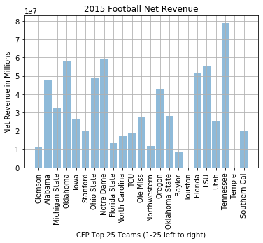

# Analyzing Financial Success in the College Football Playoff
Financial analysis of the four teams selected in the College Football Playoff from 2014 - 2017.

## 2014 Playoff
* **Alabama** spent **$51M** to make the playoff and made a net revenue of **$45.9M** *(10th highest in FBS)*
* **Oregon** spent **$20.6M** to make the playoff and made a net revenue of **$40.2M** *(11th highest in FBS)*
* **Florida State** spent **$31.2M** to make the playoff and made a net revenue of **$39M** *(12th highest in FBS)*
* **Ohio State** spent **$32.5M** to make the playoff and made a net revenue of **$50.9M** *(7th highest in FBS)*

* **T-test statistic** = 5.2085472706871885
* **T-test p-value** = 3.957268339991969e-07

## 2015 Playoff
* **Clemson** spent **$34.6M** to make the playoff and made a net revenue of **$11.2M** *(51st highest in FBS)*
* **Alabama** spent **$56.2M** to make the playoff and made a net revenue of **$47.6M** *(11th highest in FBS)*
* **Michigan State** spent **$31.9M** to make the playoff and made a net revenue of **$32.6M** *(19th highest in FBS)*
* **Oklahoma** spent **$35.8M** to make the playoff and made a net revenue of **$58.2M** *(5th highest in FBS)*

* **T-test statistic** = 5.107270906930852
* **T-test p-value** = 6.486049090789513e-07

## 2016 Playoff
* **Alabama** spent **$62.2M** to make the playoff and made a net revenue of **$45.8M** *(11th highest in FBS)*
* **Clemson** spent **$43.9M** to make the playoff and made a net revenue of **$7.7M** *(58th highest in FBS)*
* **Washington** spent **$37.6M** to make the playoff and made a net revenue of **$42.5M** *(12th highest in FBS)*
* **Ohio State** spent **$38.4M** to make the playoff and made a net revenue of **$51.4M** *(8th highest in FBS)*

* **T-test statistic** = 4.996177577471268
* **T-test p-value** = 1.0994381309899484e-06

## 2017 Playoff
* **Clemson** spent **$46.3M** to make the playoff and made a net revenue of **$5.7M** *(62nd highest in FBS)*
* **Oklahoma** spent **$39M** to make the playoff and made a net revenue of **$63.2M** *(6th highest in FBS)*
* **Georgia** spent **$44.9M** to make the playoff and made a net revenue of **$84.1M** *(2nd highest in FBS)*
* **Alabama** spent **$62.9M** to make the playoff and made a net revenue of **$48.1M** *(12th highest in FBS)*

* **T-test statistic** = 4.737869123134426
* **T-test p-value** = 3.6110260426913373e-06

